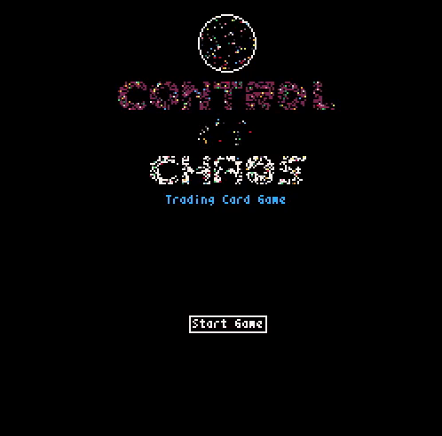

# Control of chaos: Trading card game

A trading card game coded in python with a retro graphic interface.



## Getting Started

These instructions will get you a copy of the project up and running on your local machine for development and testing purposes. See deployment for notes on how to deploy the project on a live system.

### Prerequisites

* Python 3.7+
* pip

### Installing

Clone repository

```
git clone https://github.com/crisdesivo/tcg.git
```

Install dependencies with pip

```
pip install -r requirements.txt
```

or use pip3 if your default python is older

```
pip3 install -r requirements.txt
```

## How to play it

Run main.py with python

```
python main.py
```

You can read the game rules at rules.md

## Core mechanics

* *No luck based mechanics*
* You can order your deck before the game however you want
* Small decks (around 20 cards)
* The objective of the game is to reduce all the oponent's life points
* You cause damage to your oponent by using techniques
* Techniques are used by your units and require you to discard energies
* Units and energies are two types of cards
* There are five different types of energies: Ignis, Gelo, Aer, Ordo y Chao


## Development

### Current Status of the project

* Added most of the logic of the game, but some pieces of logic are disconnected.
* Added a text user interface for testing

### Currently in development

* The graphic user interface
* The rest of the game logic

## Built With

* [Pyxel](https://github.com/kitao/pyxel) - The game engine

## Contributing

Please read [CONTRIBUTING.md](https://github.com/crisdesivo/tcg/blob/develop/CONTRIBUTING.md) for details on our code of conduct.

## Authors

* **Cristian Desivo** - *Initial work* - [cdesivo@gmail.com](mailto:cdesivo@gmail.com)

## License

This project is licensed under the GNU GENERAL PUBLIC LICENSE - see the [LICENSE.md](LICENSE.md) file for details
